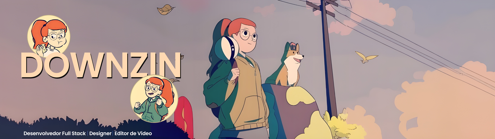

  

###

<section id="sobreMim">
  

    <h1>✨ Welcome to my profile 👾</h1>
    
ありがとう

    
  

  
  
  
  

    <blockquote>
      &nbsp;&nbsp;&nbsp;🖐🏼 Olá, eu me chamo <strong>Matheus Dantas</strong> 🤓, mas na web sou conhecido como <strong>Downzin</strong>. Desenvolvo projetos de bots para Discord, websites e design. Tenho uma paixão por aprender e adquirir conhecimentos sobre novas tecnologias! <strong>(●'◡'●)</strong>
    </blockquote>
  

  
  

    <blockquote>
      &nbsp;&nbsp;&nbsp;🧩 Tenho grande afinidade com desenhos, animes e jogos, e sou ativo em diversas comunidades no Discord, onde busco não só interação social, mas também aprendizado e oportunidades de negócio. 📚 Estou em constante aprimoramento nas áreas de audiovisual, design, web design, programação e desenvolvimento pessoal, visando oferecer entretenimento de excelência e qualidade incomparável. <strong>(¬‿¬)</strong>
    </blockquote>
  

</section>

###

<section id="conhecimento">
  

    <h1>✨ Conhecimentos e Linguagens 💻</h1>
    
知識

  

   

  

    <blockquote>
      &nbsp;&nbsp;&nbsp;Atualmente, estou matriculado no curso de Tecnologia da Informação no <a href="https://www.sp.senac.br/senac-americana">Senac - Americana</a> 📙, onde tenho a oportunidade de aprimorar minhas habilidades em manutenção e montagem de computadores, infraestrutura de redes, lógica de programação e desenvolvimento web.
    </blockquote>
  

  

    <blockquote>
      &nbsp;&nbsp;&nbsp;Além disso, venho complementando meu aprendizado por meio dos cursos oferecidos pela <a href="https://www.alura.com.br">Alura</a> 📗, uma referência no aprimoramento das minhas habilidades em programação e UI & UX. Essa trajetória de aprendizado teve início com a programação de bots no Discord, e hoje posso compartilhar orgulhosamente os conhecimentos que adquiri até o momento:
    </blockquote>
  

</section>

###

<section id='skills'>
  

    <h3>🚀 Linguagens, Tecnologias & Frameworks 💻</h3>
    
私の知識

    

      
       
      
       
      
    

  

  

    <h3>✨ Softwares, Tecnologias & Plataformas 💻</h3>
    
テクノロジー

    

      
    

  

  

    <h3>✨ Databases 💻</h3>
    
データベース

    

      
    

  

  

    <h3>📚 Tecnologias, Linguagens & Softwares que Quero Aprender 💻</h3>
    
学ぶ

    

      
       
      
       
      
    

  

</section>

###

<section id="status">
  

    <h1>📊 Meus Status 📊</h1>
    
私のステータス

    

      
       
      
      
    

  

---
  
  
Estou constantemente buscando aprimorar minhas habilidades e expandir meus conhecimentos nas diversas tecnologias que mencionei. A jornada de aprendizado é contínua e estou animado para explorar novas oportunidades e desafios. 😸

</section>

###

<section id="contato">
  

    <h1>💻 Contato </h1>
    
接触

    
<blockquote>😀 Se você tiver sugestões, feedback ou quiser colaborar em algum projeto, ficarei feliz em ouvir de você! 😁stou constantemente buscando aprimorar minhas habilidades e expandir meus conhecimentos nas diversas tecnologias que mencionei. A jornada de aprendizado é contínua e estou animado para explorar novas oportunidades e desafios. 😸</blockquote>

    

      
      
      
      
    

  

</section>

---

 

###

  
  

